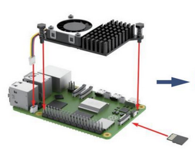
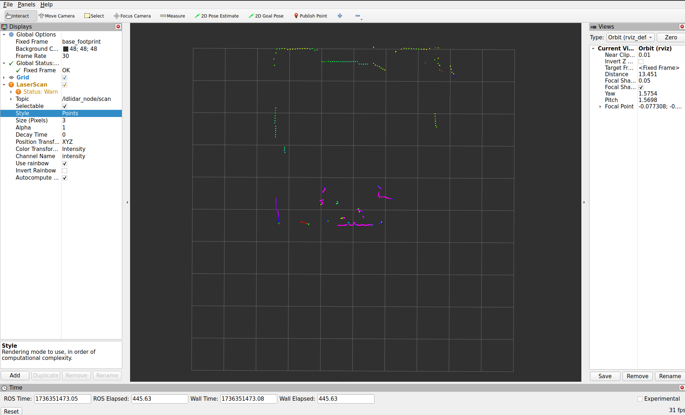
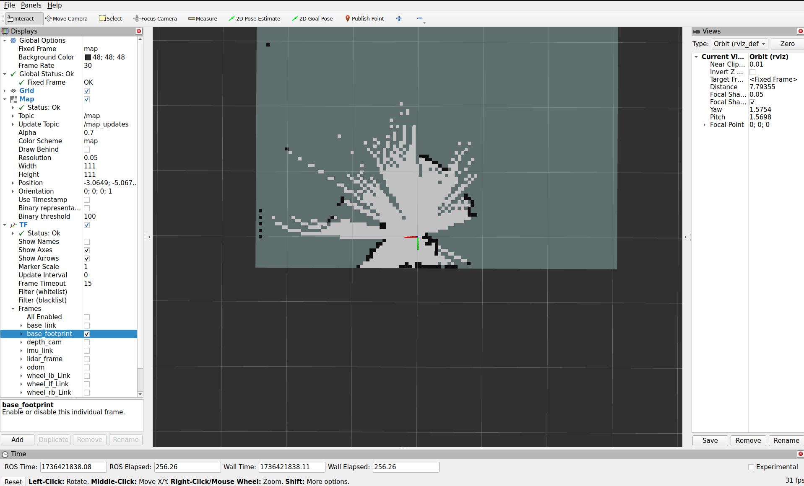

# MentorPI A1 development starter pack
This repository aims to provide a reasonable starting position for ROS2 development on the Raspberry Pi 5 based MentorPi robot platform from Hiwonder. Specifically, the version equipped with the mecanum-wheel drivetrain and the gimbal monocular camera (https://www.hiwonder.com/collections/raspberrypi-bionic-robot/products/mentorpi-m1?variant=41285892702295).

# Table of Contents
- [General Information](#general-information)  
- [Basic Setup](#basic-setup)  
   - [Linux Setup](#linux-setup)
   - [Installing ROS2](#installing-ros2)
      - [Install Additional Dependencies](#install-additional-dependencies)
   - [Setup your ROS2 Workspace](#setup-your-ros2-workspace)
   - [Set Environment Variables](#set-environment-variables)
   - [Set User Permissions](#set-user-permissions)
- [Testing](#testing)  
   - [Test the Camera](#test-the-camera)
      - [Test the Camera with a connected Monitor](#test-the-camera-with-a-connected-monitor)
      - [Test the Camera from a Remote Computer (a bit more advanced)](#test-the-camera-from-a-remote-computer-a-bit-more-advanced)
   - [Test AprilTag](#test-apriltag)
      - [Camera Calibration](#camera-calibration)
      - [Rectification Pipeline](#rectification-pipeline)
      - [AprilTag Node](#apriltag-node)
   - [Test the LIDAR](#test-the-lidar)
   - [Test SLAM](#test-slam)
- [Quality of Life Additions and Some Tips](#quality-of-life-additions-and-some-tips)
   - [Terminator](#terminator)
   - [SSH Setup](#ssh-setup)
   - [rviz2](#rviz2)
   - [Multiple Robots on the Same Network](#multiple-robots-on-the-same-network)
   - [About Standardization](#about-standardization)
   - [How To Start Development](#how-to-start-development)


# General Information
The MentorPi platform from Hiwonder is a Raspberry Pi 5 based robot platform. The operating system we will be installing on the Raspberry Pi 5 is Ubuntu 24.04, which is a version of Linux. Therefore the robot can be thought of as a normal computer, that can be used with a mouse, keyboard and monitor. The robot uses mecanum wheels, and features a monocular camera, which can be moved around, a LIDAR scanner, an inertial measurement unit (IMU), and wheel encoders.
As a development framework, the Robot Operating System (ROS2) is used. The version used is ROS2 Jazzy. ROS2 is an open-source framework for building robotic applications. It acts as the middleware between the different components of the robot and also provides tools, libraries, hardware abstraction, device drivers and more for standardized robot development.
For more information, see the ROS2 documentation: https://docs.ros.org/en/jazzy/index.html
<br>
<br>

# Basic Setup
* In this chapter, the basic setup of the robot is explained. You will install Linux, ROS2 and all necessary drivers for the motors, servos, camera and LIDAR on the Raspberry Pi 5 of the robot.
`Ubuntu 24.04` together with `ROS2 Jazzy` is used in this project.

* This README walks you through the initial setup for your robot. How and why things work may not be explained in detail. For explanation of the project structure and information about nodes and topics, see the project documentation in the `/docs` folder of this repository.

* This README assumes basic knowledge about the LINUX file system and how to navigate it. For an introduction see: https://www.digitalocean.com/community/tutorials/an-introduction-to-linux-basics
<br>

## Linux Setup
First, `Ubuntu 24.04` needs to be installed on the SD card of the Raspberry Pi 5. The SD card is located under the Raspberry PI 5 as shown below:

<p align="center">
  
</p>

1. **Flash Linux Image**  
The easiest way to flash the Linux image is via the Raspberry Pi imager.
* For Windows, you can download the program here: https://www.raspberrypi.com/software/
* On Ubuntu, you can simply install the program via the following command:
```bash
sudo apt install rpi-imager
```
Open the Raspberry PI Imager Tool, choose `Raspberry Pi 5` under *Device* and under *Choose OS*: `Other general-purpose OS` -> `Ubuntu` -> `Ubuntu Desktop 24.04.1 LTS (64-bit)`. Then choose the micro SD-card (at least 64GB) you want to install the OS on and click next to continue following the instructions of the tool.

2. **Boot for the first time**
* Put the SD-card in the Raspberry Pi 5, and connect a mouse, keyboard and a monitor. The monitor can be connected via a micro HDMI cable, the micro HDMI port is located on the Raspberry Pi 5 on the forward facing side of the robot. A mouse and a keybaord can be connected via USB using the USB dock on the backward facing side of the robot. Then, boot the robot using the switch on the black PCB above the Raspberry Pi 5. 
* Follow the installer for Ubuntu. You can choose your own username and password.
<br>

## Installing ROS2
* Follow this guide: https://docs.ros.org/en/jazzy/Installation/Ubuntu-Install-Debs.html to install ROS2 Jazzy on the Raspberry Pi 5. For development, it makes a lot of sense to also have an additional computer with ROS2 installed. This makes remotely diagnosing and controlling the robot much easier. Chose the **Desktop Install** both for the robot and, if applicable, your computer. 
* Run 
```bash
source /opt/ros/jazzy/setup.bash
```
to source the `ROS2` installation. This command needs to be entered manually every time you want to work with `ROS2` in a new terminal.
In order to avoid this, you can add it to your .bashrc file.

The .bashrc file is a script in your home directory that initializes settings, environment variables, and commands for new terminal sessions. It is executed everytime a new shell is started.

To add the command, open the file with a text editor, for example using:
```bash
nano ~/.bashrc
```
and add the new command, in this case:
```bash
source /opt/ros/jazzy/setup.bash
```
to the end of the file. Save the file and reload by either entering
```bash
source ~/.bashrc
```
or by closing the terminal and opening a new one (doing this runs the .bashrc file).
<br>
<br>

### Install Additional Dependencies
First, update your package manager:
```bash
sudo apt update
```
Then install the following packages:
* **usb_cam**
   - A ROS 2 package for interfacing with USB cameras, enabling video capture and streaming in robotic applications.
```bash
sudo apt install ros-jazzy-usb-cam
```
* **camera_calibration**
   - A ROS 2 package for calibrating USB cameras.
   - Needed to create a rectified image, wich is essential for object or Tag detection.
```bash
sudo apt install ros-jazzy-camera-calibration
```
* **image_proc**
   - A ROS 2 package for rectifying an image together with a camera calibration file.
   - Needed to create a rectified image, wich is essential for object or Tag detection.
```bash
sudo apt install ros-jazzy-image-proc
```
* **apriltag-ros**
   - A ROS2 package for detecting **AprilTags**, which are fiducial markers used for **robot localization and object tracking**.
   - Important for object detection and relative position calculation.
```bash
sudo apt install ros-jazzy-apriltag-ros
```
* **apriltag-msgs**
   - A ROS2 package with the proprietary messages used by the `apriltag` package.
```bash
sudo apt install ros-jazzy-apriltag-msgs
``` 
* **slam_toolbox**  
   - A ROS 2 package for Simultaneous Localization and Mapping (SLAM), providing tools for 2D SLAM, map merging, and long-term mapping.  
   - Essential for robots that require real-time environment mapping and localization in unknown areas.  
```bash
sudo apt install ros-jazzy-slam-toolbox
```
* **navigation2**
   - A ROS 2 package for robot navigation, enabling autonomous path planning, obstacle avoidance, and control.
   - Required for setting up navigation tasks in your robotic project.
```bash
sudo apt install ros-jazzy-navigation2
```
* **joint-state-publisher**
   - A tool for publishing the state of all joints in a robot.
   - Essential for visualizing robot movement or simulating joint positions in RViz.
```bash
sudo apt install ros-jazzy-joint-state-publisher
```
* **xacro**
   - Stands for XML Macros and is used to simplify the creation of URDF files for robot models.
   - Required for generating dynamic robot description files.
```bash
sudo apt install ros-jazzy-xacro
```
* **ros-jazzy-imu-complementary-filter**
   - Provides a complementary filter for IMU data processing in the ROS Jazzy distribution.
   - Helps in fusing accelerometer and gyroscope data for smoother motion tracking.
```bash
sudo apt install ros-jazzy-imu-complementary-filter
```
* **python3-transforms3d**
   - A Python library for handling 3D transformations such as rotations and translations.
   - Used in the `JoystickControl` package for manipulating 3D poses and transformations.
```bash
sudo apt install python3-transforms3d
```
* **python3-pydantic**
   - A Python library for data validation and settings management.
   - Required by the `ros usb_cam` package to handle camera configurations and data structures.
```bash
sudo apt install python3-pydantic
```
<br>

## Setup your ROS2 Workspace
In addition to the global ROS2 workspace we just installed in `/opt/ros/jazzy`, an additional workspace in your home directory `/home/user` is needed. (Substitute your home directory).
In general, ROS2 packages installed via the package manager get installed in the global workspace, while your own projects and code are usually organized in a separate ROS2 workspace inside your home folder. We will follow this structure.

1. **Create the following file structure** inside your home directory ~
```bash
|-- workspace
    |-- ros2_ws
        |-- src
```
You can achieve this with the following command:
```bash
mkdir -p ~/workspace/ros2_ws/src
```
Navigate inside the `ros2_ws` folder and initialize the new workspace with
```bash
colcon build
```
You may need to install colcon at this point. It can be installed with: 
```bash
sudo apt install colcon
```
After this, you can source your workspace with
```bash
source install/local_setup.bash
```

This command can also be added to your .bashrc file. This way, your workspace is sourced every time a new terminal is opened. Use the correct path, e.g.:
```bash
source /home/user/workspace/ros2_ws/install/local_setup.bash
```
**Make sure** to change `user` to the username you chose for the robot.

2. **Download the needed Packages from this repository**
    - Download all folders from the `src` folder and place it in **your** `src` folder.

* **Finished file structure**  
The finished file structure should look like the following:
```bash
|-- workspace
    |-- ros2_ws
        |-- build
        |-- install
        |-- log
        |-- src
            |-- calibration
            |-- imu_calib
            |-- ldrobot-lidar-ros2
            |-- peripherals
            |-- driver
            |-- orchestrator_launch
            |-- simulations
```
4. **Build the workspace again**  
When you are in the `ros2_ws` folder, you can build the workspace again with
```bash
colcon build
```
**Make sure** the build process succeeds.
<br>
<br>

## Set Environment Variables
Because the MentorPi robot comes in different versions, the used version needs to be exported as an environment variable:
```bash
export MACHINE_TYPE=MentorPi_Mecanum
```
This command should also be added to your .bashrc file to ensure the availability of the variable upon startup of a new terminal.
<br>
<br>

## Set User Permissions
Communication with the expansion board occurs via a serial connection. To enable access, you must ensure your user belongs to the appropriate group with permissions to access serial devices. This is achieved with:
```bash
sudo usermod -a -G dialout $USER
```
You need to restart your Raspberry Pi 5 for this rule to take effect. 
<br>
<br>

# Testing
If you successfully installed everything we can start testing.

## Test Motor Functions
The expansion board from Hiwonder controls all 4 wheels, the 2 PWM servos the camera is attached to and also allows for access to the IMU. 
All this functionality is managed by the `controller` package, which can be found in `~/workspace/ros2_ws/src/driver`.
With
```bash
ros2 launch controller controller.launch.py
```
you can launch this package. You can verify a successful launch by typing
```bash
ros2 topic list
```
in a second terminal. This will list all topics currently published or subscribed to by all running nodes. After the launch of the `controller` package, the list should look like the following:
```bash
matthias@matthiasT15:~$ ros2 topic list
/cmd_vel
/controller/cmd_vel
/controller_manager/joint_states
/diagnostics
/imu
/imu/rpy/filtered
/imu/steady_state
/imu_corrected
/joint_states
/odom
/odom_raw
/odom_rf2o
/parameter_events
/robot_description
/ros_robot_controller/battery
/ros_robot_controller/bus_servo/set_position
/ros_robot_controller/bus_servo/set_state
/ros_robot_controller/button
/ros_robot_controller/enable_reception
/ros_robot_controller/imu_raw
/ros_robot_controller/joy
/ros_robot_controller/pwm_servo/set_state
/ros_robot_controller/sbus
/ros_robot_controller/set_buzzer
/ros_robot_controller/set_led
/ros_robot_controller/set_motor
/ros_robot_controller/set_oled
/ros_robot_controller/set_rgb
/rosout
/set_odom
/set_pose
/tf
/tf_static
```
Now the fun part begins. Open yet another terminal and type
```bash
ros2 launch peripherals joystick_control.launch.py
```
This launches the joystick_control part of the `peripherals` package. This node handles the controller. Make sure the controller is switched on. The controller should now be connected to the USB dongle plugged in to the Raspberry Pi 5. 
The left joystick controls the linear motion of the robot, while the right controls the rotational momentum. With the D-Pad, you can additionally rotate the camera around. Pressing "START" resets the camera position.
<br>
<br>

## Test the Camera

### Test the Camera with a connected Monitor
Run
```bash
ros2 launch peripherals usb_cam.launch.py
```
to launch the `camera` node from the `peripherals` package. Typing
```bash
ros2 topic list
```
you should see 
```bash
matthias@matthiasT15:~$ ros2 topic list
/ascamera/camera_publisher/rgb0/camera_info
/ascamera/camera_publisher/rgb0/compressedDepth
/ascamera/camera_publisher/rgb0/image
/ascamera/camera_publisher/rgb0/image_compressed
/ascamera/camera_publisher/rgb0/image_raw/theora
/image_raw/zstd
```
these topics added to your list. `/ascamera/camera_publisher/rgb0/image` is the topic we care about. Run
```bash
ros2 run rqt_image_view rqt_image_view
```
A window should open. In the top left dropdown menu choose `/ascamera/camera_publisher/rgb0/image` as the topic. Now the live video feed from the camera should be displayed.\
You may need to physically adjust the focus by turning the lens of the camera. Pliers may be needed.
<br>
<br>

### Test the Camera from a Remote Computer (a bit more advanced)
Viewing the video feed from a remote computer is not as straight forward. While all `ROS2` topics published by one machine are visible by all machines running `ROS2` in the same network by default, displaying the raw video stream on a remote machine is not generally possible (bandwidth limitation). Instead, the `/ascamera/camera_publisher/rgb0/image_compressed` topic published by the `camera_node` is utilized. By running a decompresser node on the receiving machine, we can decompress the compressed image on the receiving machine and then display this decompressed image.

**Requirements** for streaming the video feed to a different computer in the same network:
- The receiving computer needs to run `ROS2` (preferably `ROS2 Jazzy`)
- A basic `ROS2` workspace needs to be setup on the receiving computer with the `image_decompressor` package installed (The package can be downloaded from this repository).
- Both, the Raspberry Pi 5 and the receiving computer need to be connected to the same network (Eduroam does not work).  

**Setting up the Connection**  
1. Launch the `camera` node on the Raspberry Pi 5:
```bash
ros2 launch peripherals usb_cam.launch.py
```
2. Run the `decompress_image_node` from the `image_decompressor` package on the receiving computer:
```bash
ros2 run image_decompressor decompress_image_node
```
3. Run `rqt_image_view` on the receiving computer and select the `/decompressed_image` topic to display the decompressed image, the `decompress_image_node` publishes.
```bash
ros2 run rqt_image_view rqt_image_view
```
<br>

## Test AprilTag
The AprilTag detection can only detect tags in a rectified image. Meaning straight objects in real life also appear straight in the image. The `image_proc` package we installed earlier can handle this for us, given we calibrate the camera first. 
<br>
<br>

### Camera Calibration
You can calibrate the image with the ROS2 package `camera-calibration`. First, make sure the camera node is running:
```bash
ros2 launch peripherals usb_cam.launch.py
```
Follow this tutorial on camera calibration: https://wiki.ros.org/camera_calibration/Tutorials/MonocularCalibration  
The correct command for our workspace is:
```bash
ros2 run camera_calibration cameracalibrator --size MxN --square X image:=/ascamera/camera_publisher/rgb0/image camera:=/ascamer
```
Make sure to replace **M** with the vertical height of your calibration checkerboard and **N** with the horizontal length of your calibration checkerboard. **X** is the length of one square of the checkerboard in meters. Clicking on Upload will save the calibration file at the correct place. If everything works correctly, you can see where the file was saved in the command window in which `usb_cam` is running.  
<br>
<br>

### Rectification Pipeline
As already discussed, we will use the `image_proc` package to rectify our raw image the `usb_cam` node provides. This is easiest with a launch script from the `peripherals` package, which launches both the `usb_cam` node and the `image_proc` node. So before running, make sure the `usb_cam` is not already running on its own.
```bash
ros2 launch peripherals image_pipeline.launch.py
```
The topic `/apriltag_detections` should now also be published. Just like the raw image, you can display this rectified version with:
```bash
ros2 run rqt_image_view rqt_image_view
```
<br>

### AprilTag Node
You can start the AprilTag detection with the launch file provided in the `peripherals` package:
```bash
ros2 launch peripherals apriltag.launch.py
```
This launch file references the `apriltag_config.yaml` located in the `config` folder of the `peripherals` package. This config file specifies the used detection algorithm and the tag-family. Every tag that can be detected must also be listed here. The 6 Tags of the 6 sides of the provided cube are already added to this file.\
The AprilTag detection should now be working. To verify, place the cube in front of the camera and listen to the `/apriltag_detection` topic:
```bash
ros2 topic echo /apriltag_detection
```
<br>

## Test the LIDAR
To test the LIDAR, you need the `controller` node again:
```bash
ros2 launch controller controller.launch.py
```
Now you can launch the `ldlidar_node` present in the `ldrobot-lidar-ros2` folder:
```bash
ros2 launch ldlidar_node ldlidar.launch.py
```
You see the following topics added to your topic list:
```bash
matthias@matthiasT15:~$ ros2 topic list
/bond
/diagnostics
/ldlidar_node/scan
/ldlidar_node/transition_event
/parameter_events
/rosout
```
The `/ldlidar_node/scan` is the important one. 
Open `rivz2` either on the Raspberry Pi 5 or a different computer in the same network running `ROS2` with:
```bash
rviz2 
```
In `rviz2` click on *map* next to *Fixed Frame* in the *Global Options* on the left side. Select *base_footprint* from the dropdown menu. Then click on *add* in the lover left corner and select *LaserScan* from the list. Press *OK*. *LaserScan* should now appear in the left list in red. Click on it to open a dropdown. Click right of *Topic* in the whitespace. An empty dropdown menu should appear. Select `/ldlidar_node/scan` from this menu. The live LIDAR points should now be displayed in the middle. By selecting *Points* next to the *Style* field, you can make the points better visible.

<br>
<br>

## Test SLAM
**SLAM** is short for *Simultaneous Localization and Mapping* and describes the process of mapping one's surroundings while localizing oneself inside this map. It is key for autonomous navigation in an unknown environment. The `ROS2` package `slam_toolbox` can be used to perform this using live LIDAR data and a complete transformation tree. This tree describes the position of the LIDAR in respect to the main coordinate origin of the robot. This transformation tree is implemented in the `controller` package.
1. Launch the `controller` node: (if not already running)
```bash
ros2 launch controller controller.launch.py
```
2. Launch the ldlidar_node: (if not already running)
```bash
ros2 launch ldlidar_node ldlidar.launch.py
```
3. Launch the `slam_toolbox` with a custom launch file located inside the `orchestrator_launch` package:
```bash
ros2 launch orchestrator_launch slam_toolbox.launch.py
```
4. Launch rviz2 either on the Raspberry Pi 5 or on a computer running `ROS2` inside the same network:
```bash
rviz2
```
5. Click on *Add* in the lower left corner and select *Map* from the list. Then press *OK*. Now select `/map` as the *Topic* in the dropdown Menu under the newly created *Map* entry in the left list. The beginnings of a map should now be visible in the middle of the screen.
6. To add the position of the robot inside the map, click *Add* again and select *TF* from the list. Then click *OK*. The position and orientation should now be displayed. Under *Frames*, you can choose which "position" you want to see. Only selecting *base_footprint* may be the most sensible. 

7. You can now launch the joystick_control from the `peripherals` package again:
```bash
ros2 launch peripherals joystick_control.launch.py
```
You should now be able to move around with the robot while the map is continuously updated.
<br>
<br>

# Quality of Life Additions and Some Tips

## Terminator
As you may already noticed, you often have to work with many terminals in paralel. A tiling terminal emulator can help with this. `Terminator` is a nice choice.
```bash
sudo apt install terminator
```
With
   - `strg`+`shift`+`e` you can split the terminal vertically.
   - `strg`+`shift`+`o` you can split the terminal horizontally.
<br>

## SSH Setup
* For easier development, connecting to the Raspberry Pi 5 via SSH is strongly recommended. For this, the Raspberry Pi 5 needs to be connected to the same network as the device from which you want to access the Raspberry Pi 5 (Eduroam does not work).

SSH is not standard installed on Ubuntu 24.04, so we need to install it:
```bash
sudo apt update
sudo apt install openssh-server -y
```
Then, run: 
```bash
sudo systemctl enable ssh
sudo systemctl start ssh
```
To verify that ssh is running, run:
```bash
sudo systemctl status ssh
```
It should say **active (running)**.

Look up the IP address from the Raspberry Pi 5 with:
```bash
hostname -I
```
**Make sure**  to use a capital I.

Now you can connect to the Raspberry Pi 5 from your other computer:
```bash
ssh user@IP-address
```
**Replace** `user` with the username of your robot and `IP-address` with the IP-address of your Raspberry Pi 5. 

* Additionally, installing `sshfs` on your machine will allow you to mount  remote file systems. This way you could for example mount the `workspace` folder of your Raspberry Pi 5 in your file system and conveniently edit files with any code editor you like on your machine.

1. Install `sshfs` on your machine:
```bash
sudo apt install sshfs
```
2. Mount a remote folder:
```bash
sshfs user@IP-address:/remote/file/path /local/file/path
```
Of course **replace** `user` `IP-adress` `/remote/file/path` and `local/file/path` with your specific data. 
   - `/remote/file/path` is the path on the remote machine you want to make accessible from your machine
   - `local/file/path` is the file path on your local machine you want to mount the remote folder in. Creating a special folder like `~/remote_code` may be sensible.
<br>

## rviz2
Rviz2 is a visualization tool for ROS2 that allows you to view sensor data, robot models, and transformations in real time.
It can be launched via:
```bash
rviz2
```
Some of the data from the ROS2 topics can be visualized via rviz2, the following are especially relevant.
* TF - all of the transformations between the robot's parts (**NOTE: ** the transformation to the camera uses a depth camera and is incorrect, moving the camera around using the servos is also not accounted for).
* Robot Model - displays the robot with the robot's URDF model (**NOTE: ** to properly display the robot, you need the stl files located in this repository under ros2_ws/src/simulations/mentorpi_description/meshes)
* Odometry (odom) - displays the robot's movement
* Laser Scan - visualizes the LIDAR sensor data
* map - displays the generated SLAM map
<br>

## Multiple Robots on the Same Network
ROS2 topics and nodes are accessible over the entire network. When using multiple robots in the same network, you may want to separate the networks from each other. This is easily achieved via the `ROS_DOMAIN_ID`. All ROS2 clients with the same exported ID can see each other. The default ID is `0`.
You can change the ID of your ROS2 client for example to id `10` with:
```bash
export ROS_DOMAIN_ID=10
```

## About Standardization
Most things in ROS2 are standardized. This means there probably is a "standard way" to expose, for example, a topic on which velocity requests can be made. For this specific task, the topic is called `/cmd_vel` and has the type `geometry_msgs/Twist`. This standard naming and typing is mostly adhered to in this workspace. This also allows, for example, easy integration with standard ROS2 packages like `slam_toolbox`. This package expects odometry information to be published on `/odom` and a laser scan published on `/scan`. Both of these, of course, also have an expected type. Because the `controller` package that exposes the `/odom` topic adheres to this standard and `ldrobot-lidar-ros2` almost adheres to this (only the topic name needs to be changed via the launch script), integration is fairly easy. All of this is to say, if you also adhere to the sometimes unwritten rules of standard naming and typing, you can make your life a lot easier. 

## How To Start Development
If you are ready to implement some code, here are some general tips and ideas to get you started.\
* If you want to implement some functionality, it makes probably sense to organize it in a new package, with
```bash
ros2 pkg create <package_name> --build-type ament_cmake
```
you can create a new cmake package, and with
```bash
ros2 pkg create <package_name> --build-type ament_cmake
```
you create a new python package. **Make sure** you are inside your build folder (`ros_ws/src`), before entering these commands.

* If you installed a package via the package manager, it is installed in `/opt/ros/jazzy/share`. Some standard launch and parameter files are usually given here. If you want to use such a "standard package" you most likely need to at least adjust the launch script and the parameter files. It is best practice to **not** modify installed packages in `/opt/ros/...`, instead you should organize them inside a package of your own workspace. In our structure, both the `orchestrator_launch` and the `peripherals` package are good places for this. You can copy the given launch scripts and parameter files from `/opt/ros/jazzy/share/package_name/` into one of these packages and launch the installed packages from there.
